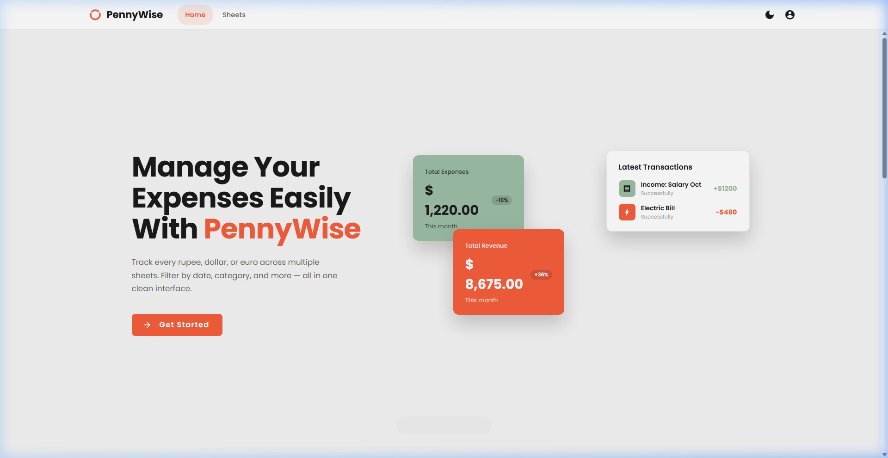
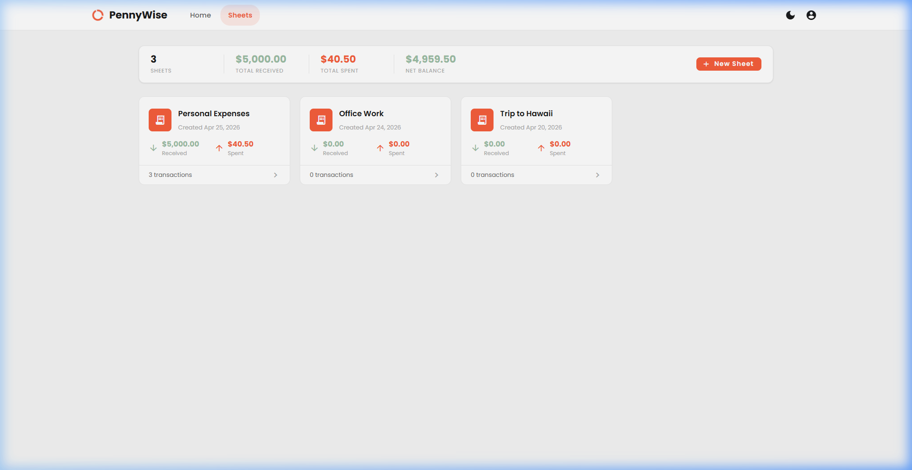
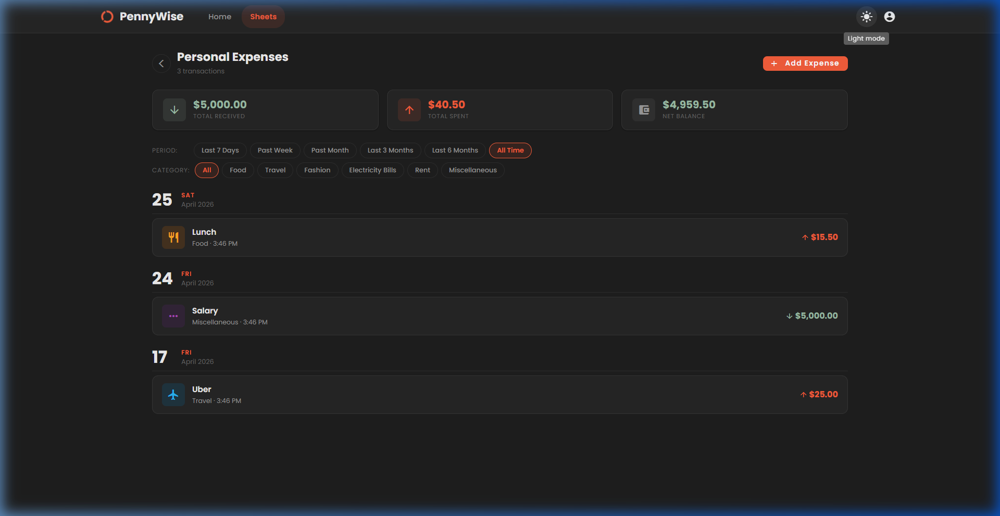
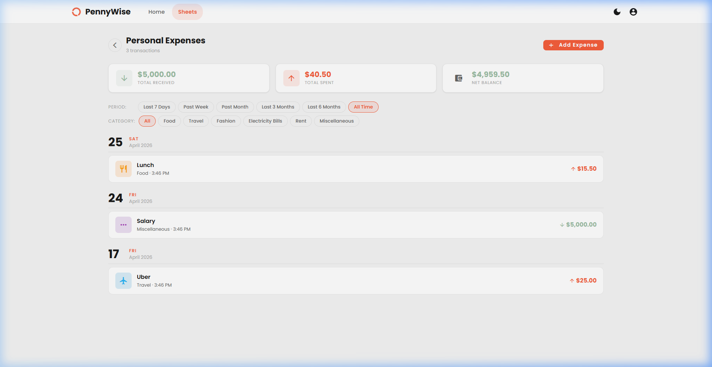

# PennyWise - Premium Expense Tracker

PennyWise is a modern, responsive, and feature-rich expense tracking application built with **Angular** and **Angular Material**. It helps users manage their finances easily across multiple sheets with a focus on clean design and intuitive user experience.

> [!NOTE]
> **Status:** This project is currently in the **active development phase**. All data is currently **hardcoded** (mocked) for demonstration purposes, and persistence (backend integration) is planned for future updates.

## ✨ Features

### 🚀 Modern Landing Page
- **Hero Section**: A stunning introduction to the app with clear calls to action.
- **Features Grid**: Highlights core capabilities like multiple sheets, smart filtering, and live balances.
- **Animated Testimonials**: A smooth, auto-scrolling marquee showcasing user trust and feedback.

### 📊 Expense Management
- **Multiple Sheets**: Organize your finances into different sheets (e.g., Personal, Work, Travel).
- **Transaction Tracking**: Add, edit, and view transactions with ease.
- **Money Lover Pattern**: Transactions are beautifully grouped by date for better readability.
- **Rich Categorization**: Assign categories like Food, Travel, Rent, and more with color-coded icons.

### 🔍 Smart Tools
- **Real-time Filtering**: Filter transactions by date range (7 days, 1 month, etc.) or category instantly.
- **Live Balances**: See your total received, total spent, and net balance update in real-time.
- **Inline Editing**: Quick access to edit sheet details and transactions.

### 🎨 Premium UI/UX
- **Dark & Light Mode**: Switch between a sleek dark theme and a clean light mode.
- **Responsive Design**: Fully optimized for various screen sizes.
- **Rich Aesthetics**: Uses Poppins typography and a harmonious coral-based color palette.

## 📸 Screenshots

<p align="center">
  
  <br>
  <em>Home Page - Modern Landing Design</em>
</p>

<p align="center">
  
  <br>
  <em>Sheets Overview - Manage multiple expense sheets</em>
</p>

<div align="center">
  <table>
    <tr>
      <td align="center">
        
        <br>
        <em>Dark Mode</em>
      </td>
      <td align="center">
        
        <br>
        <em>Light Mode</em>
      </td>
    </tr>
  </table>
</div>

## 🛠️ Tech Stack
- **Frontend**: Angular 17, Angular Material, SCSS.
- **Icons**: Material Icons.
- **Fonts**: Google Fonts (Poppins).

## 📈 Progress Made
- [x] **UI Modernization**: Complete overhaul of the landing page and core layout.
- [x] **Feature Implementation**: Added multiple sheets and transaction management.
- [x] **Refactoring**: Organized the codebase by moving interfaces to `models.ts` and data to `constants.ts`.
- [x] **Branding**: Implemented "PennyWise" branding across the app.
- [x] **Styling Fixes**: Optimized footer layout and ensured consistent width with the navigation bar.
- [x] **Theming**: Integrated a dynamic theme switching service.

## 🚀 Getting Started

### Prerequisites
- Node.js and npm installed.
- Angular CLI installed (`npm install -g @angular/cli`).

### Installation
1. Clone the repository.
2. Navigate to the `client` directory:
   ```bash
   cd client
   ```
3. Install dependencies:
   ```bash
   npm install
   ```
4. Start the development server:
   ```bash
   npm run start
   ```
5. Open your browser and navigate to `http://localhost:4200`.

---
Built with ❤️ by Naman
